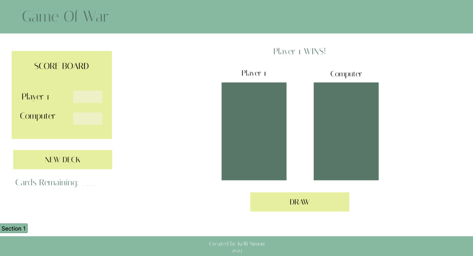

# Game Title - Game Of War 

## Getting Started
* https://kellims.github.io/Project_One-Game_Of_War/

## User Experience

* User will compete in the card game War, against the computer.
* User will be able to imput their name before the beginning of the game, which will update the default Player 1 name.
* User will be able to press a button, which will draw a card for each player, each round.
* Players will each be randomly assigned a new card from the deck (1-10, A, K, Q, and J, from each of the four suits ♣♦♥♠)
* At the end of each round, the Score Board will update with the new score. 
* At any time & at the end of the game, the User will be able to click the 'New Deck' button, to clear the game and start with a fresh deck. 
* User will be able to see how many cards remain in the current deck.
* When there are no cards left in the deck, a winner will be declared based on the highest score.

## How To Play

* The goal of the game is to have the highest score at the end.
* Each player draws a random card for each round.
* Highest card value wins the round.
* Repeat rounds until the card deck has been used.
* Highest score wins.

## Wireframe

https://www.figma.com/file/hVTL3Y8uZZBpxBi7RgfLAn/Untitled?node-id=0%3A1&t=qB7SB4QD53rGGLeE-1

## Technologies Used:
* HTML
* CSS
* JavaScript and JQuery

## Next Steps

* In the case of a tie, building in the ability to break the tie with additional cards being drawn. 
* The ability to store multiple wins after x amount of games, or 'best of x'.
* Build into the project an ability to play different card games.
* Clickable pop-up which contains the rules of 'War'
* Require player to 'confirm' their selection when choosing the 'New Deck' button.
* Ability to let player enter their name, which then updates 'Player 1'